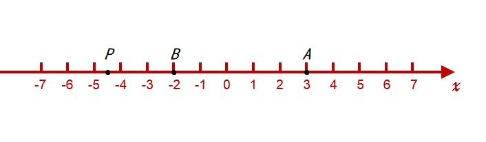

# 2.1 不等式的基本性质

## 2.1.1 实数的大小

实数与数轴上的点之间可以建立一一对应的关系。

在上图中，点 $A$ 与数 $3$ 对应，点 $B$ 与数 $-2$ 对应等。

可以看到当数轴上一动点 $P$ 从左向右移动时，它对应的实数就从小到大变化。

这就是说，**数轴上的任意两点中，右边的点对应的实数比左边的点对应的实数大**。

例如，点 $A$ 位于点 $B$ 的右边，则点 $A$ 对应的实数 $3$ 比点 $B$ 对应的实数 $-2$ 大，即 $3<-2$。

同样有 $3>-3$、$0>-2$、$3>0$、$-3>-4$、$4>3$ 等。

在上图中，设 $A$、$B$ 为任意两个实数，则 $A$、$B$ 在数轴上的位置有且只有以下三种：

（1）点 $A$ 在点 $B$ 右侧（上图(1)）；（2）点 $A$ 与点 $B$ 重合（上图(2)）；（3）点 $A$ 与点 $B$ 左侧（上图(3)）；

相应的，实数 $A$、$B$ 的关系为：

（1）$\Huge A >B$ （2）$\Huge A=B$ （3）$\Huge A<B$

上面三个式子的另一表达方法是：

1. $\Huge A-B>0 \hArr A>B$
2. $\Huge A-B=0 \hArr A=B$
3. $\Huge A-B<0 \hArr A<B$

含有不等号（$<, =, >, \le, \ge, \not =$）的式子，叫做 **不等式**。

## 2.1.2 不等式的基本性质

从实数大小的基本性质出发，可以证明下列不等式的重要性质。

**传递性** 通常叫做 **不等式的传递性**。

**加法法则** 与 **乘法法则** 通常叫做 **作差比较法**。

### 传递性

#### 性质

如果 $a>b, b>c$ 则 $a>c$。

#### 分析

要证 $a>c$，只要证 $a-c>0$。

#### 证明

因为 $a-c=(a-b)+(b-c)$  
又由 $a>b, b>c$ ，即 $a-b>0, b-c>0$  
所以 $(a-b)+(b-c)>0$  
因此 $a-c>0$  
即 $a>c$

### 加法法则

不等式的两边同时加上（或同时减去）同一个实数，不等号的方向不变。

#### 性质

如果 $a>b$ ，则 $a+c>b+c$。

#### 证明

因为 $(a+c)-(b+c)=a-b$  
又由 $a>b$ ，即 $a-b>0$  
所以 $a+c>b+c$

### 乘法法则

如果不等式两边都乘同一个正数，则不等号方向不变，如果都乘同一个负数，则不等号的方向改变。

#### 性质

如果 $a>b,c>0$ 则 $ac>bc$；如果 $a>b,c<0$ 则 $ac<bc$。

#### 证明

因为 $ac-bc=(a-b)c$  
又由 $a>b$ ，即 $a-b>0$  
所以：
- 当 $c>0$ 时，$(a-b)c>0$ ，即 $ac>bc$；
- 当 $c<0$ 时，$(a-b)c<0$ ，即 $ac<bc$；

### 推论：如果 $a+b>c$ ，则 $a>c-b$

**不等式中任何一项，变号后可以从一边移到另一边。**

#### 证明

因为 $a+b>c$  
所以 $a+b+(-b)>c+(-b)$ （加法法则）  
即 $a>c-b$

### 推论：如果 $a>b$ ，且 $c>d$ ，则 $a+c>b+d$

**两个或几个同向不等式，两边分别相加，所得的不等式与原不等式同方向。**

#### 证明

因为 $a>b$  
所以 $a+c>b+c$ （加法法则）  
因为 $c>d$  
所以 $b+c>b+d$  
因此 $a+c>b+d$ （传递性）  

### 推论：如果 $a>b>0$ ，且 $c>d>0$ ，则 $ac>bd$

**两个或几个两边都是正数的同向不等式，把它们的两边分别相乘，所得的不等式与原不等式同向。**

#### 证明

因为 $a>b$ ，且 $b>0$  
所以 $ac>bc$ （乘法法则）  
因为 $c>d$ ，且 $b>0$  
所以 $bc>bd$  
因此 $ac>bd$ （传递性）  

