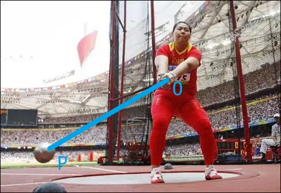

# 5.1 角的概念的推广及其度量

## 5.1.1 角的概念的推广

在初中时学过，在平面内，角可以看作一条射线绕着它的端点旋转而形成的图形。

当时不考虑旋转方向，不论射线 $OA$ 旋转到 $OB$ ，
还是从射线 $OB$ 旋转到 $OA$ ，它们的旋转绝对量都是一样的，
而且旋转的绝对量不超过一个周角。

在现实生活中，有很多角的大小超过这个范围。

> 2008 年 8 月 20 日，我国选手
> [张文秀](https://baike.baidu.com/item/%E5%BC%A0%E6%96%87%E7%A7%80/25142)
> 在北京奥运会女子链球决赛中夺得铜牌，实现了中国链球奥运奖牌零的突破，
> 上图为张文秀在比赛中的照片。

链球是用一条链子与把手相连的金属球。
掷链球是一项田径投掷运动，运动员在投掷圈内通过旋转 3~4 圈，
使链球逐渐获得加速，最后将链球投出。

观察上图，可以发现，射线 $OP$ 可以沿逆时针方向旋转，也可以沿着顺时针方向旋转，
$OP$ 转过的角度也不是一个平角。

为了描述链球转过的角度的大小与方向，有必要对角的概念加以推广。

### 正角

按 *逆时针* 方向旋转而成的角叫做 **正角**。

### 负角

按 *顺时针* 方向旋转而成的角叫做 **负角**。

### 零角

当射线 *没有旋转* 时，也把它看成一个角，叫做 **零角**。

### 转角

在画图时，常用带箭头的弧来表示旋转方向和旋转的绝对量。

旋转生成的角，又常称为 **转角**。

### 各角和的旋转量等于各角旋转量的和

$90 \degree  - 30 \degree$ 可直接看成 $90 \degree$ 与 $-30 \degree$ 的和。

$\alpha - \beta$ 可直接看成 $\alpha$ 与 $- \beta$ 的代数和。

引入正、负角的概念后，角的减法运算都可以转化为角的加法运算。

### 标准位置

在直角坐标系中讨论角时，通常使角的顶点与坐标原点重合，
角的 *始边* 与 $x$ 轴的正半轴重合。

这样角的大小和方向就可以确定 *终边* 所在的坐标系中的位置。

这样放置的角，就可以说它在坐标系中处于 **标准位置**。

处于标准位置的角的 *终边* 落在第几象限，就叫第几象限的角。

