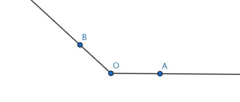

# 5.1 角的概念的推广及其度量

## 5.1.1 角的概念的推广

在初中时学过，在平面内，角可以看作一条射线绕着它的端点旋转而形成的图形。

当时不考虑旋转方向，不论射线 $OA$ 旋转到 $OB$ ，
还是从射线 $OB$ 旋转到 $OA$ ，它们的旋转绝对量都是一样的，
而且旋转的绝对量不超过一个周角。

在现实生活中，有很多角的大小超过这个范围。

> 2008 年 8 月 20 日，我国选手
> [张文秀](https://baike.baidu.com/item/%E5%BC%A0%E6%96%87%E7%A7%80/25142)
> 在北京奥运会女子链球决赛中夺得铜牌，实现了中国链球奥运奖牌零的突破，
> 上图为张文秀在比赛中的照片。

链球是用一条链子与把手相连的金属球。
掷链球是一项田径投掷运动，运动员在投掷圈内通过旋转 3~4 圈，
使链球逐渐获得加速，最后将链球投出。

观察上图，可以发现，射线 $OP$ 可以沿逆时针方向旋转，也可以沿着顺时针方向旋转，
$OP$ 转过的角度也不是一个平角。

为了描述链球转过的角度的大小与方向，有必要对角的概念加以推广。

### 正角

按 *逆时针* 方向旋转而成的角叫做 **正角**。

### 负角

按 *顺时针* 方向旋转而成的角叫做 **负角**。

### 零角

当射线 *没有旋转* 时，也把它看成一个角，叫做 **零角**。

### 转角

在画图时，常用带箭头的弧来表示旋转方向和旋转的绝对量。

旋转生成的角，又常称为 **转角**。

### 各角和的旋转量等于各角旋转量的和

$90 \degree  - 30 \degree$ 可直接看成 $90 \degree$ 与 $-30 \degree$ 的和。

$\alpha - \beta$ 可直接看成 $\alpha$ 与 $- \beta$ 的代数和。

引入正、负角的概念后，角的减法运算都可以转化为角的加法运算。

### 标准位置

在直角坐标系中讨论角时，通常使角的顶点与坐标原点重合，
角的 *始边* 与 $x$ 轴的正半轴重合。

这样角的大小和方向就可以确定 *终边* 所在的坐标系中的位置。

这样放置的角，就可以说它在坐标系中处于 **标准位置**。

处于标准位置的角的 *终边* 落在第几象限，就叫第几象限的角。

## 5.1.2 弧度制

> [弧度制_百度百科](https://baike.baidu.com/item/%E5%BC%A7%E5%BA%A6%E5%88%B6/3315973)

把一圆周 360 等分，则其中一份所对的圆心角是 1 度角。
这种用度做单位来度量角的制度叫做 **角度制**。

由此可见，在同一圆内，角是用它对的圆弧来度量的，角的大小与它所在的圆弧长成正比，
弧长扩大几倍，这段弧所对应的角也相应扩大相同的倍数。

<iframe src="https://www.geogebra.org/calculator/ymfcfeu9?embed" width="100%" height="600" allowfullscreen style={{border: '1px solid #e4e4e4', borderRadius: '4px'}} frameborder="0"></iframe>

观察上图，两个大小不同的同心圆，虽然同一圆心角 $a$ 所对应的弧长与半径都不相等，
但弧长与半径长成正比例，即它们的比值 $\Large \frac{l}{r}$ 是一个常数。

这表示弧长与半径的比值，与半径长度无关，而只与 $a$ 的角度有关，
因此可以使用圆的半径作为单位去量弧。

把等于半径长的圆弧所对应的圆心角叫做 1 **弧度的角**。

例如上图中，$\overgroup{AB}$ 的长等于半径 $r$ ，
$\overgroup{AB}$ 所对的圆心角就是 1 **弧度的角**，
弧度记作 $\Large \text{ rad}$ 。

### 角度制与弧度制的换算关系

长为 $l$ 的弧所对的圆心角（正角）$a = \frac{l}{r} (\text{ rad})$ 。

已知，圆周长 $l = 2 \pi r$ 因此：
- 周角 $\Large = \frac{2 \pi r}{r} = 2 \pi \text{ rad}$
- 平角 $\Large = \pi \text{ rad}$
- 直角 $\Large = \frac{\pi}{2} \text{ rad}$

但平角又等于 $180 \degree$ ，于是可得到角度制与弧度制的换算关系：

$$
\large
  \pi \text{ rad} = 180 \degree \\
  1 \text{ rad}
    = ( \frac{180}{\pi}) \degree 
    \approx 57 \degree 18 \rq
    = 57.30 \degree \\
\LARGE
  1 \degree
    = \frac{\pi}{180} \text{ rad}
    \approx 0.01745 \text{rad} \\
$$

### 弧度制与角度制的换算公式

设一个角的弧度为 $a$ ，角度为 $n \degree$ （分和秒都要先转换为度表示），则：

$$
\Huge
a = n \sdot \frac{\pi}{180} 
\qquad
n = a \sdot \frac{180}{\pi}
$$

### 总结

角的概念推广以后，无论用角度制还是弧度制，都能在角的集合与实数集 $\mathbf{R}$
之间建立一种一一对应的关系：

- 每个角都有唯一的一个实数（角度数或弧度数）与之对应；
- 反之，每个实数也都有唯一的一个角与之对应；

理解以上对应关系时，应当注意角度制是 60 进位制，遇到如 $35 \degree 6 \rq$
这样的角，应把它化为 10 进制的数值 $35.1 \degree$ 。

但弧度制不存在上述问题，弧度数是 10 进制的实数，
这是角度制与弧度制的一个重要区别。
